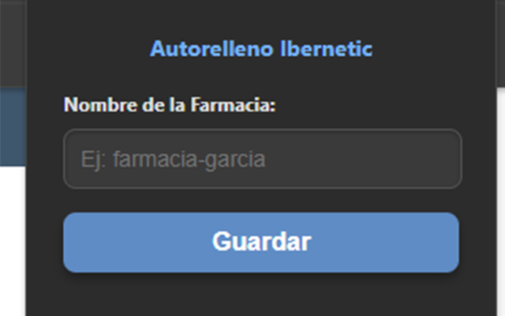

# 🤖 AutoRelleno Sitename (Ibernetic Panel Login)

Una extensión simple de Google Chrome para auto-rellenar el campo "Sitename" en la página de inicio de sesión del panel de control de Ibernetic.

## ⚠️ AVISO IMPORTANTE (Extensión de Terceros)

**Esta extensión NO es un producto oficial de Ibernetic ni está afiliada a la empresa de ninguna manera.**

Es una herramienta independiente desarrollada para uso personal y comunitario. Su uso es bajo su propia responsabilidad.

***

## 🚀 Instalación

La forma más sencilla de instalar la extensión es a través de la Chrome Web Store:

[**INSTALAR DESDE CHROME WEB STORE (Disponible Pronto)**](https://chrome.google.com/webstore/)

> **Nota:** La URL anterior es un marcador de posición. Será funcional una vez que la extensión sea publicada oficialmente por Google.

***

## ⚙️ Características

* **Finalidad Única:** Rellena automáticamente el campo `sitename` al cargar la página de login de `https://panel.ibernetic.com/`.
* **Configuración:** Permite al usuario guardar su `sitename` a través del menú (popup) de la extensión.
* **Privacidad:** Los datos de configuración se almacenan **solo localmente** en tu navegador.

***
## 📸 Capturas de Pantalla

Así es como se ve la extensión en acción:

### Menú de Configuración

### Campo de Login Auto-Rellenado

***

## 🛠️ Instalación para Desarrolladores (Alternativa)

Si la extensión aún no está en la Web Store, puedes instalarla manualmente:

1.  Descarga el código o clona este repositorio.
2.  Abre Chrome y navega a `chrome://extensions`.
3.  Activa el **"Modo de desarrollador"**.
4.  Haz clic en **"Cargar extensión sin empaquetar"** y selecciona la carpeta de la extensión.

***

## 🧑‍💻 Estructura del Proyecto

* `manifest.json`: Definiciones y permisos (Manifest V3).
* `popup.html` / `popup.js`: Interfaz de configuración y lógica de guardado local.
* `content.js`: Script inyectado para realizar el auto-relleno.
